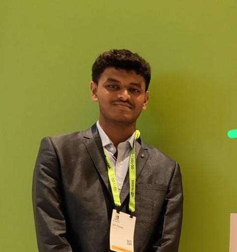

<h1>AthleteVerse</h1>

AthleteVerse is a comprehensive platform revolutionizing the Indian sports ecosystem by empowering athletes both on and off the field. Built with Flutter, Firebase, and Google Cloud, it tackles key challenges like resource accessibility, injury prevention, career development, and financial planning. From AI-driven performance tracking to mentorship and gamified learning, AthleteVerse provides an all-in-one solution that fosters growth, inclusivity, and accessibility in sports. Committed to transforming the athletic landscape, it bridges gaps, supports talent, and helps athletes reach their full potential.

AthleteVerse is reshaping Indian sports while driving impact across 11 UN Sustainable Development Goals, ensuring inclusivity, well-being, and growth for athletes nationwide.

## User Types in AthleteVerse

- **Athletes** – Track performance, explore tournaments, manage injuries, secure sponsorships, plan finances, build a strong professional network, and plan a successful career.
- **Coaches** – Design training programs, monitor athlete progress, provide expert mentorship, and connect with sponsors.
- **Sports Organizations** – Scout talent, manage teams, collaborate with professionals, and facilitate sponsorship opportunities.
- **Admins** – Oversee platform operations, verify users, manage anonymous reports, conduct platform testing, and handle blogs, webinars, and community engagement.

## 🔑 Demo Access
**Email:** athleteverse@gmail.com  
**Password:** athleteverse

## 🚀 Key Features

- AI-Powered Performance Analytics
- Injury Prevention & Rehabilitation
- Sponsorship Matchmaking
- Career Transition Support
- Smart Financial Management
- Government Scheme Integration
- Sports Gear Rental System
- Travel Budgeting Tools
- Anonymous Reporting System
- Para-Athlete Support
- Women's Safety Features
- Mental Health Assistance
- Doping Compliance
- Gamified Learning
- Freelance Opportunities
- Community Hub
- Expert Webinars

## 🖼️ Screenshots

  
  

## 👥 Team AthleteVerse
From **Jawaharlal Nehru Engineering College**, Mahatma Gandhi University, Chh. Sambhajinagar

<table>
  <tr>
    <td align="center">
      <a href="https://www.linkedin.com/in/aman-singh35/">
         
        <b>Aman Singh</b>
      </a>
    </td>
    <td align="center">
      <a href="https://www.linkedin.com/in/khushi-shinde-b32287291">
         
        <b>Khushi Shinde</b>
      </a>
    </td>
    <td align="center">
      <a href="https://www.linkedin.com/in/khushi-borde-759258303">
         
        <b>Khushi Borde</b>
      </a>
    </td>
    <td align="center">
      <a href="https://www.linkedin.com/in/omthoratcse/">
         
        <b>Om Thorat</b>
      </a>
    </td>
  </tr>
</table>

## 🌟 Our Mission
AthleteVerse isn't just an app - it's a movement to revolutionize sports, empower athletes, and ensure every talent gets the chance to shine!